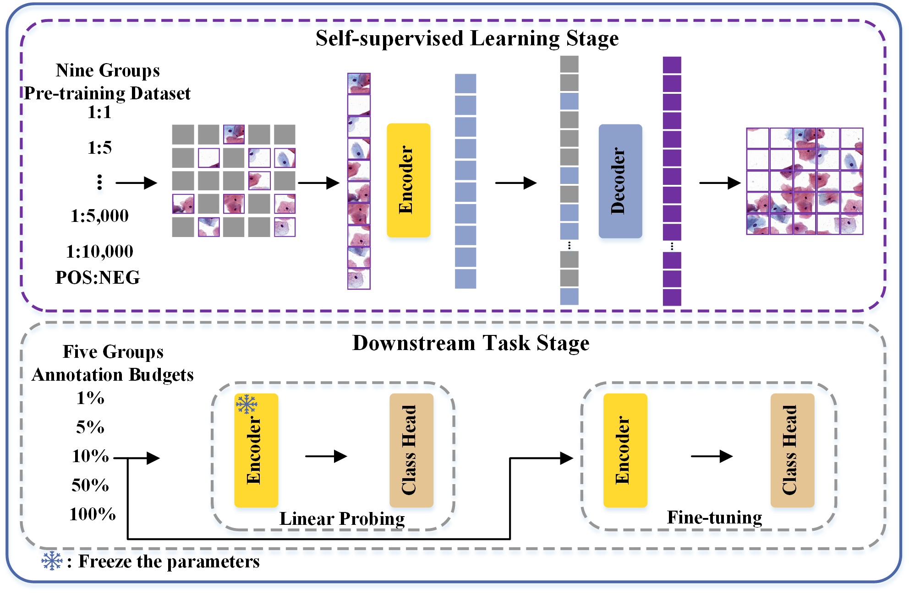

# The Impact of Cervical Cytology Category Imbalance on Self-supervised Representation Learning

The implementation of investigating impact of cervical cytology category imbalance on self-supervised representation learning.

## Pipeline

The overall research framework is divided into two stages: the self-supervised representation learning  stage and the downstream tasks stage. The self-supervised representation learning stage applies two types of self-supervised learning methods: generative self-supervised learning (MAE) and discriminative self-supervised learning based on contrastive learning methods  (SimCLR).

## Dependency

The main dependencies of this project are as follows:

- python=3.8

- torch=2.0.1

- torchvision=0.15.2
- timm=0.4.12
- tensorboard=2.13.0 
- transformers=4.31.0

## Checkpoint

The project organizes relevant checkpoints based on different self-supervised learning frameworks, encompassing self-supervised representation learning weights and weights for downstream tasks like linear probing and fine-tuning. The directory structure is delineated below: 

**SSRL name** \
├── **pretrained** \
│   ├── ratio_1-1.pth \
│   ├── ratio_1-5.pth \
│   ├──     ...    \
│   └── ratio_1-10,000.pth \
├── **downstream tasks** \
│   ├── **linear probing** \
│   │    ├── ratio_1-100.pth \
│   │    ├──       ...       \
│   │    └── ratio_100-100.pth \
│   ├── **fine-tune**              \
│   │    ├── ratio_1-100.pth \
│   │    ├──      ...   \
│   │    └── ratio_1-100.pth 

The following table provides the relevant checkpoints:

|             | MAE                                                          | SimCLR                                                       |
| ----------- | ------------------------------------------------------------ | ------------------------------------------------------------ |
| checkpoints | <a href="https://pan.baidu.com/s/1IStQfEDL7FkCajwQ_2uEKA?pwd=2dix"> download  </a> | <a href="https://pan.baidu.com/s/1RPOv4Nxbp43bXeL65Caw6A?pwd=89x7"> download </a> |

## Implementation

​        The details of pre-training under two  self-supervised representation learning methods and the training and evaluation of related downstream tasks can be found in the respective **README.md** files of each project. 
